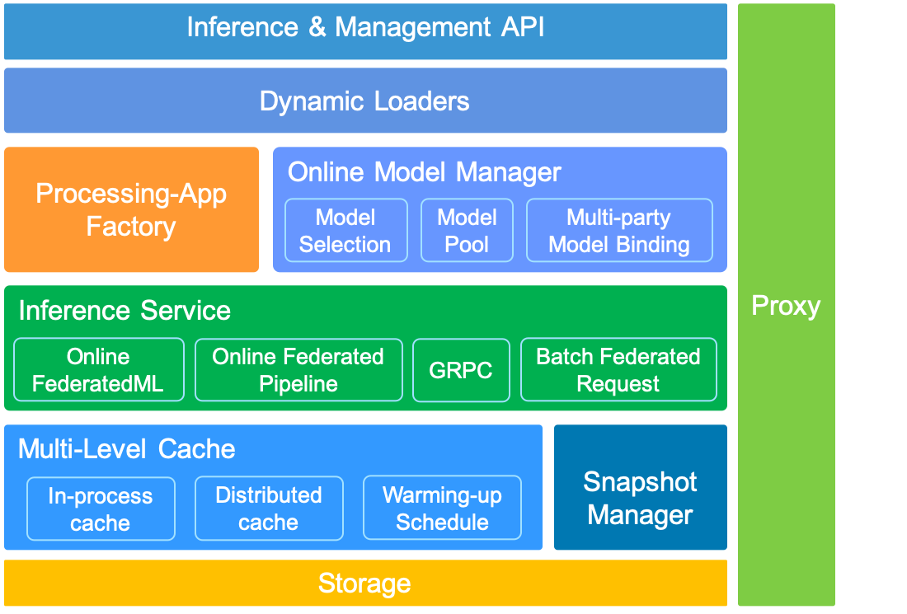

# FATE-Serving

   

## 介绍

FATE-Serving 是针对联邦学习模型的高性能工业化服务系统，专为生产环境设计。

### FATE-Serving 现在支持

- 高性能的在线联邦学习算法。
- 联邦学习在线推理工作流。
- 动态加载联邦学习模型。
- 可以服务于多个模型或同一模型的多个版本。
- 支持 A/B 测试实验模型。
- 使用联邦学习模型进行实时推理。
- 支持多级缓存，用于远程方联合推断结果。
- 支持用于生产部署的预处理、后处理及数据访问适配器。
- 通过使用 zookeeper 作为注册表为 grpc 界面提供服务管理（可选）
- 发布模型的请求会持久保存在本地文件中，因此在重新启动应用程序时将自动加载已加载的模型

## 联邦学习在线推理工作流

## 架构

## 部署

准备工作如下：

1. 服务器依赖于 Redis，需要提前安装 Redis。
2. 所有模型都在 JVM 中运行，需要预先安装 Java。
3. 确认是否需要服务管理功能，可以在配置文件中将其设置为启用，如果启用，则需要预先安装 Zookeeper。

普通部署架构如图所示，如果使用此模式，则需要在配置文件中手动配置每个模块的 IP 地址

如果要使用服务管理，则部署架构如下所示：

- 服务运行服务器：基于GRPC的联合学习在线推理服务
- 服务路由：将请求路由到服务服务器或另一方，此模块的功能类似于FATE中的代理模块
- Zookeeper：作为注册中心

### Zookeeper中的数据

### serving-server.properties
关键配置项说明：

|配置项目|配置项含义|配置项值|
| - | - | - |
| ip |监听FATE服务的地址|默认值 0.0.0.0 |
| port |监听FATE-Serving的grpc服务器的端口|默认值 8000 |
| workMode | FATE-Flow的工作模式| 0（单机），1（集群）|
| inferenceWorkerThreadNum |进行异步推理的工作者数量|默认值 10 |
| standaloneStoragePath |独立EggRoll的存储路径|通常是PYTHONPATH/data|
| remoteModelInferenceResultCacheSwitch |远程模型推理结果高速缓存存储的切换|默认true |
|proxy|代理地址|定制配置|
|roll|roll的地址|定制配置|
| OnlineDataAccessAdapter |数据访问适配器类，用于获取主机特征数据|默认 TestFile，从服务服务器根目录上的``host_data.csv``中读取主机功能数据|
| InferencePostProcessingAdapter |推理后处理适配器类，用于在模型推理后处理结果|默认值 PassPostProcessing |
| InferencePreProcessingAdapter |推理预处理适配器类，用于在模型推理之前处理来宾特征数据默认PassPreProcessing |
| useRegister |是否将接口注册到注册表|默认 false |
| useZkRouter |通过注册到zookeeper的接口信息发送路由请求|默认 false |
| zk.url | zookeeper网址，例如：zookeeper:// localhost:2181?backup=localhost:2182,localhost:2183 |默认 zookeeper://localhost:2181 |
| coordinator |服务方ID |默认 webank|
| serviceRoleName |联邦角色模型名称|默认 serving|
| modelCacheAccessTTL |访问后模型缓存生存时间值|默认值12 |
| modelCacheMaxSize |模型缓存的最大大小|默认值50 |
| remoteModelInferenceResultCacheTTL |远程模型推断结果缓存在访问后生存时间值|默认值300 |
| remoteModelInferenceResultCacheMaxSize |远程模型推断结果缓存的最大大小|默认值10000 |
| inferenceResultCacheTTL |推理结果缓存在访问后生存时间值|默认值30 |
| inferenceResultCacheCacheMaxSize |推理结果缓存的最大大小|默认值1000 |
| redis.ip |连接主机|默认值127.0.0.1 |
| redis.port |接受指定端口上的redis连接|默认值6379 |
| redis.password |连接密码|默认fate_dev |
| redis.timeout |客户端空闲N秒后关闭连接|默认值10 |
| redis.maxTotal |池可以分配的最大对象数|默认值100 |
| redis.maxIdle |池中可以容纳的最大“空闲”实例数；如果没有限制，则为负数|默认值100 |
| external.remoteModelInferenceResultCacheTTL |访问外部缓存后，远程模型推断结果缓存生存时间值|默认86400 |
| external.remoteModelInferenceResultCacheDBIndex |外部|远程模型推断结果缓存DBIndex|默认值0 |
| external.inferenceResultCacheTTL |访问外部缓存后，推理结果缓存生存时间值|默认值300 |
| external.inferenceResultCacheDBIndex |外部缓存的推理结果缓存DBIndex默认值0 |
| external.processCacheDBIndex |进程缓存DBIndex用于外部缓存|默认值0 |
| canCacheRetcode |通过retcode缓存结果|默认值0,102 |
| acl.username | Zookeeper ACL认证用户名| |
| acl.password | Zookeeper ACL认证用户密码| |

### proxy.properties
关键配置项说明：

|配置项目|配置项含义|配置项值|
| - | - | - |
| ip | FATE-Serving-Router的监听地址|默认0.0.0.0 |
| port |监听FATE-Serving-Router的端口|默认9370 |
|coordinnator|服务的聚会ID |默认 webank|
| zk.url | zookeeper 地址，与服务端设置保持一致 | 默认 zookeeper://localhost:2181 |
| useRegister |是否将接口注册到注册表|默认 false |
| useZkRouter |通过注册到zookeeper的接口信息发送路由请求|默认 false |
| route.table |路由器表配置文件的绝对路径|默认/data/projects/fate/serving-router/conf/route_table.json |
| acl.username | Zookeeper ACL认证用户名| |
| acl.password | Zookeeper ACL认证用户密码| |

### 部署服务服务器
有关详细信息，这是一些关键步骤：

    1.git clone https://github.com/FederatedAI/FATE-Serving.git
    2.cd FATE-Serving
    3.mvn clean package
    4.copy serve-server/target/fate-serving-server-1.1.2-release.zip 到您的部署位置并解压缩
    5.根据您自己的要求修改配置文件conf/serving-server.properties 
    6.确认是否已安装 Java。您可以通过 java -version 命令检查。
    7.sh service.sh restart

### 部署服务路由

有关详细信息，这是一些关键步骤：

    1.与服务运行服务器部署步骤1/2/3相同，如果已执行，则可以跳过
    2.将router / target / fate-serving-router-1.1.2-release.zip复制到部署位置并解压缩。
    3.根据自己的要求修改配置文件conf / proxy.properties和conf / route_table.json 
    5.确认是否已安装Java。您可以通过java -version命令进行检查。
    6.sh service.sh restart

## 用例
FATE-Serving 提供发布模型和在线推理的 API。

### 发布模型

请使用 FATE-Flow 客户端，该客户端可在 fate-flow 中进行操作，请参阅**在线指南**中的[fate_flow_readme](https://github.com/FederatedAI/FATE/blob/master/fate_flow/README.md)。

### 推理

服务目前使用grpc协议，支持三个与推理相关的接口。

- inference:发起推理请求并获得结果
- startInferenceJob:启动推理请求任务而不用返回结果
- getInferenceResult:通过caseid获得推断的结果

请参考此脚本进行推断。

### 适配器

服务支持实际生产中的预处理，后处理和数据访问适配器。

- 预处理:模型计算之前的数据预处理
- 后期处理：模型计算后的数据后处理
- 数据访问：从聚会系统获取功能

在当前阶段，您需要将Java代码重新编译，并在以后的支持中以发行版的形式动态加载jar。

目前：

- 将您的预处理和后处理适配器代码推送到 fate-serving/serving-server/src/main/java/com/webank/ai/fate/serving/adapter/processing 中，并修改 InferencePreProcessingAdapter/InferencePostProcessingAdapter 配置参数。
- 将您的数据访问适配器代码推送到 fate-serving/serving-server/src/main/java/com/webank/ai/fate/serving/adapter/dataaccess 中，并修改 OnlineDataAccessAdapter 配置参数。

请参考 PassPostProcessing, PassPreProcessing, TestFile适配器。

### 远程方多级缓存

对于联邦学习，一个推理需要由多方计算。在生产环境中，各方被部署在不同的 IDC 中，并且多方之间的网络通信是瓶颈之一。

因此，fate-serving 支持在启动器上缓存多方模型推断结果，但从不缓存特征数据。您可以在配置中打开 remoteModelInferenceResultCacheSwitch。
